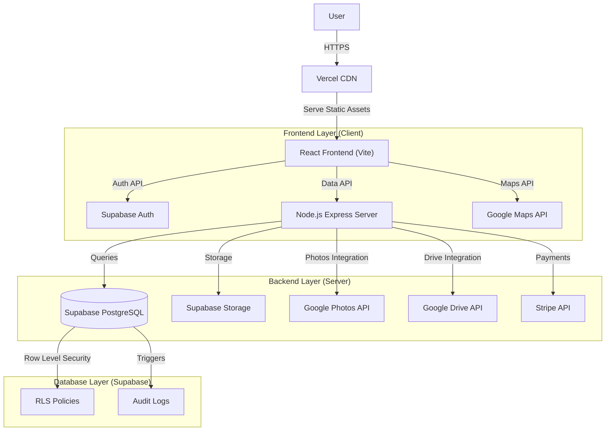
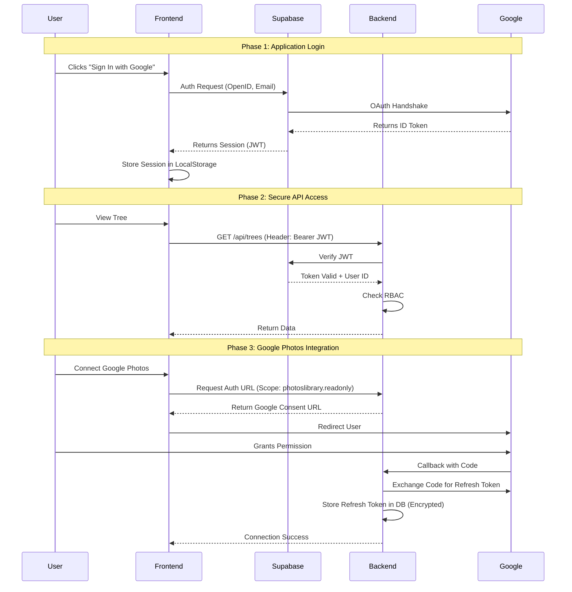
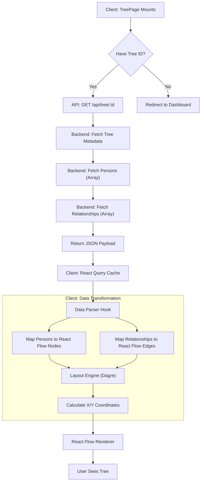
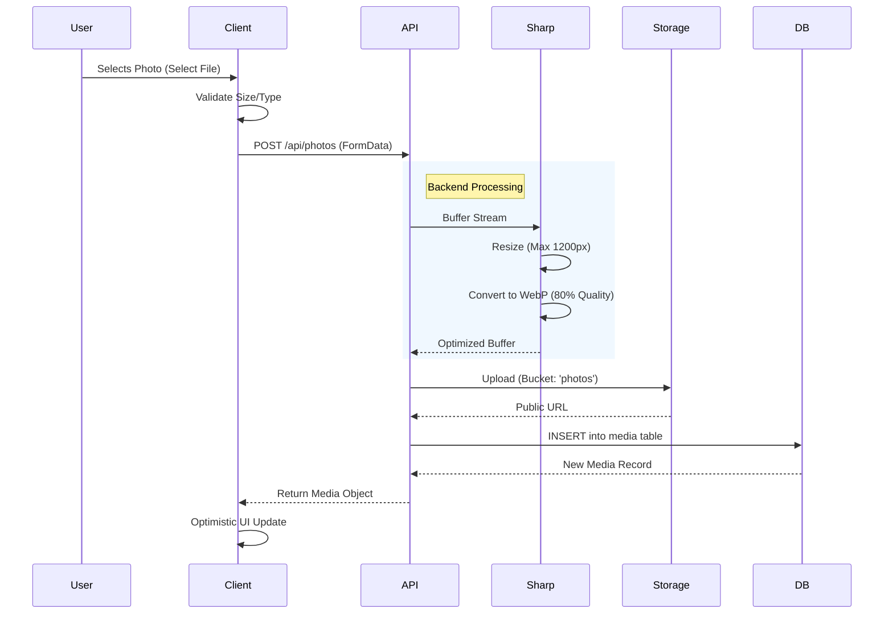

# Roots & Branches - System Architecture

## Overview
"Roots & Branches" is a modern, full-stack web application designed for interactive family tree management. It utilizes a decoupled architecture with a React frontend (Vite) and a Node.js/Express backend, relying on Supabase for database and authentication services.

## High-Level Architecture

## Detailed Tech Stack

### Frontend (Client)
- **Framework**: React 18
- **Build Tool**: Vite
- **Styling**: Tailwind CSS v3
- **State Management**: React Context + Custom Hooks
- **Visualization**: React Flow (Tree Graph), Leaflet (Maps)
- **Routing**: React Router DOM v6
- **HTTP Client**: Axios (with interceptors for auth)

### Backend (Server)
- **Runtime**: Node.js
- **Framework**: Express.js
- **Database Interface**: `supabase-js` (PostgreSQL via Supabase)
- **Authentication**: Supabase Auth (JWT Validation)
- **Image Processing**: Sharp (for optimization)
- **Validation**: Joi (API Schema Validation)

### Database (Data Layer)
- **System**: PostgreSQL
- **Host**: Supabase
- **Security**: Row Level Security (RLS) enabled on all tables
- **Key Tables**: `trees`, `persons`, `relationships`, `media`, `users`

## Data Flow Principles
1.  **Authentication First**: All private routes require a simplified JWT validation. The frontend handles the initial login via Supabase Auth, obtaining an `access_token`.
2.  **Token Passing**: This token is passed in the `Authorization: Bearer <token>` header to the customized Backend.
3.  **Backend Verification**: The Express middleware (`middleware/auth.js`) verifies the token with Supabase and attaches the `user` object to the request.
4.  **Authorization (RBAC)**: Specific middleware (`middleware/rbac.js`) checks if the user has the required role (Owner/Editor/Viewer) for the target resource.
5.  **Data Retrieval**: The controller utilizes the Supabase client (with the user's context or a service role if strictly necessary) to fetch data.
6.  **Response**: Data is returned as JSON.

## Key Design Decisions
-   **Dual OAuth**: Separates "Login" (Supabase) from "Services" (Custom Google OAuth for Drive/Photos) to avoid scope creep and improve reliability.
-   **No ORM**: Uses raw Supabase client/SQL for performance and simplicity, leveraging PostgreSQL features like RLS directly.
-   **Optimistic UI**: The frontend updates state immediately for critical actions (like moving a node) while the request processes in the background.

## Complex Process Diagrams

### Authentication Flow (Dual OAuth)

### Tree Data Fetching & Rendering

### Image Upload Pipeline

