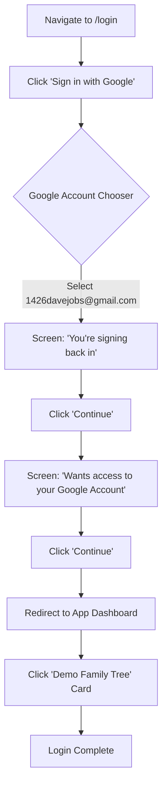

# Skill: Browser Login Automation

This skill provides step-by-step instructions for an agent to perform a complete login flow using browser automation tools (like Playwright or the `browser_subagent`).

## 1. Prerequisites
- **Email**: `1426davejobs@gmail.com`
- **Base URL**: `http://localhost:5174` (Standard dev port)
- **Tool**: `browser_subagent` or equivalent Playwright-based tool.

## 2. Login Flow Diagram

## 3. Detailed Browser Instructions

| Step | Action | Expected Selector / UI Element |
| :--- | :--- | :--- |
| **1** | Navigate to `http://localhost:5174/login` | Page loads the "Welcome back" screen. |
| **2** | Click **Sign in with Google** | Button contains a Google G-logo and "Sign in with Google". |
| **3** | Select Google Account | Look for an entry with text `1426davejobs@gmail.com`. |
| **4** | Confirm Identity | On the screen "You're signing back in to...", click the primary **Continue** button. |
| **5** | Grant Permissions | On the screen "...wants access to your Google Account", click the primary **Continue** button. |
| **6** | Wait for App | Wait for the browser to redirect back to the app (URL usually matches `/trees` or `/`). |
| **7** | Select Tree | Find the card or link labeled **"Demo Family Tree"** and click it. |

## 4. Best Practices for Agents
- **Timeouts**: Wait up to 10 seconds for the Google OAuth popups/redirects as they can be slow.
- **Verification**: After step 7, verify the URL contains `/tree/` to confirm successful entry into the visualization.
- **State Management**: If already logged in, the agent should detect the presence of the "Sign Out" button or Dashboard instead of trying to login again.
