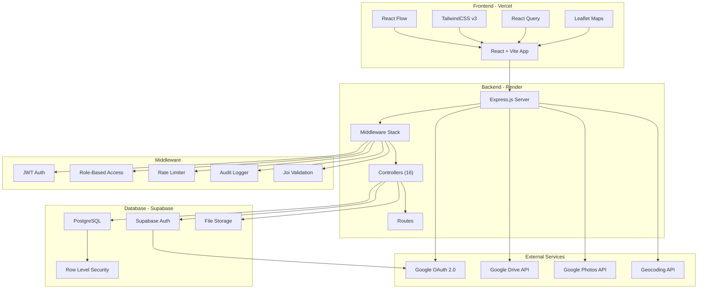
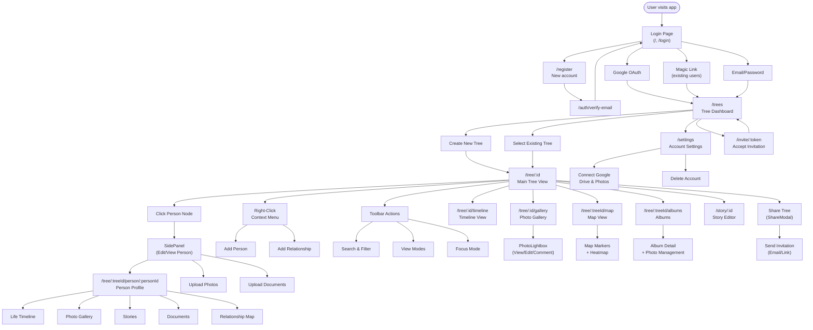
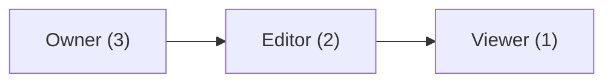

# API Documentation

## Overview

The Family Tree API provides RESTful endpoints for managing family trees, persons, relationships, media, stories, albums, locations, and more.

**Base URL:** `http://localhost:3000/api` (development)

**Authentication:** JWT tokens via Supabase Auth

---

## Authentication

### Headers
All authenticated requests require:
```
Authorization: Bearer <jwt_token>
```

### Getting a Token
Use Supabase client authentication:
```javascript
const { data: { session } } = await supabase.auth.getSession();
const token = session.access_token;
```

---

## Architecture Diagram



## User Flow Diagram



---

## Endpoints Reference

### Trees

| Method | Endpoint | Auth | Role | Description |
|--------|----------|------|------|-------------|
| `GET` | `/api/trees` | ✅ | — | Get all trees for current user |
| `POST` | `/api/trees` | ✅ | — | Create a new tree |
| `GET` | `/api/tree/:id` | ✅ | Viewer | Get tree with all persons and relationships |
| `DELETE` | `/api/tree/:id` | ✅ | Owner | Delete a tree |

#### Create Tree
```http
POST /api/trees
```
**Body:**
```json
{ "name": "Smith Family Tree", "description": "Optional description" }
```
**Validation:** `name`: required, 1-200 chars. `description`: optional, max 1000 chars.

---

### Persons

| Method | Endpoint | Auth | Role | Description |
|--------|----------|------|------|-------------|
| `POST` | `/api/person` | ✅ | Editor | Create a new person |
| `PUT` | `/api/person/:id` | ✅ | Editor | Update a person's details |
| `DELETE` | `/api/person/:id` | ✅ | Editor | Delete a person (cascades relationships) |
| `POST` | `/api/person/merge` | ✅ | Editor | Merge two duplicate persons |
| `GET` | `/api/person/:id/media` | ✅ | Viewer | Get legacy media attachments |

#### Create Person
```http
POST /api/person
```
**Body:**
```json
{
  "tree_id": "uuid",
  "first_name": "John",
  "last_name": "Doe",
  "dob": "1980-01-01",
  "dod": null,
  "gender": "Male",
  "bio": "Biography text",
  "occupation": "Engineer",
  "pob": "New York, NY",
  "place_of_death": null,
  "cause_of_death": null,
  "burial_place": null,
  "occupation_history": ["Engineer at Acme", "Intern at BigCo"],
  "education": "MIT, Computer Science",
  "profile_photo_url": "https://..."
}
```
**Validation:**
- `tree_id`: Required UUID
- `first_name`: Required, 1-100 chars
- `dob`/`dod`: ISO date, cannot be future, death must be after birth
- `gender`: `Male`, `Female`, `Other`, `Unknown`
- Age validation: Max 150 years
- `occupation_history`: Array of strings (max 20) or comma-separated string

#### Merge Persons
```http
POST /api/person/merge
```
**Body:**
```json
{ "keep_person_id": "uuid", "merge_person_id": "uuid" }
```

---

### Relationships

| Method | Endpoint | Auth | Role | Description |
|--------|----------|------|------|-------------|
| `POST` | `/api/relationship` | ✅ | Editor | Create a relationship between two persons |
| `DELETE` | `/api/relationship/:id` | ✅ | Editor | Delete a relationship |

#### Create Relationship
```http
POST /api/relationship
```
**Body:**
```json
{
  "tree_id": "uuid",
  "person_1_id": "uuid",
  "person_2_id": "uuid",
  "type": "parent_child",
  "status": "current"
}
```
**Validation:**
- `type`: Required — `parent_child`, `spouse`, `adoptive_parent_child`, `step_parent_child`, `sibling`
- `status`: Optional — `current`, `divorced`, `widowed`, `separated`
- Cannot create self-relationships
- Prevents duplicate relationships

---

### Photos

| Method | Endpoint | Auth | Role | Description |
|--------|----------|------|------|-------------|
| `POST` | `/api/photos` | ✅ | Editor | Add a photo to a person |
| `GET` | `/api/person/:id/photos` | ✅ | Viewer | Get all photos for a person |
| `PUT` | `/api/photos/:id` | ✅ | Editor | Update photo metadata |
| `DELETE` | `/api/photos/:id` | ✅ | Editor | Delete a photo |
| `GET` | `/api/tree/:id/photos` | ✅ | Viewer | Get all photos across tree |

#### Add Photo
```http
POST /api/photos
```
**Body:**
```json
{
  "person_id": "uuid",
  "url": "https://...",
  "caption": "Family photo",
  "date_taken": "2020-01-01",
  "is_primary": false
}
```

---

### Documents

| Method | Endpoint | Auth | Role | Description |
|--------|----------|------|------|-------------|
| `POST` | `/api/documents` | ✅ | Editor | Add a document to a person |
| `GET` | `/api/person/:id/documents` | ✅ | Viewer | Get all documents for a person |
| `PUT` | `/api/documents/:id` | ✅ | Editor | Update document metadata |
| `DELETE` | `/api/documents/:id` | ✅ | Editor | Delete a document (+ storage cleanup) |

#### Add Document
```http
POST /api/documents
```
**Body:**
```json
{
  "person_id": "uuid",
  "url": "https://...",
  "title": "Birth Certificate",
  "type": "pdf",
  "source": "upload",
  "external_id": null,
  "description": "Scanned copy"
}
```

---

### Life Events

| Method | Endpoint | Auth | Role | Description |
|--------|----------|------|------|-------------|
| `POST` | `/api/person/:id/events` | ✅ | Editor | Add a life event to a person |
| `GET` | `/api/person/:id/events` | ✅ | Viewer | Get all events for a person |
| `PUT` | `/api/events/:id` | ✅ | Editor | Update a life event |
| `DELETE` | `/api/events/:id` | ✅ | Editor | Delete a life event |
| `GET` | `/api/photos/:id/events` | ✅ | Viewer | Get events linked to a photo |
| `GET` | `/api/tree/:id/events` | ✅ | Viewer | Get all events across tree |

#### Add Life Event
```http
POST /api/person/:id/events
```
**Body:**
```json
{
  "event_type": "graduation",
  "title": "Graduated from MIT",
  "date": "2005-06-15",
  "end_date": null,
  "location": "Cambridge, MA",
  "description": "Bachelor of Science",
  "media_ids": ["photo-uuid-1"],
  "location_ids": ["location-uuid-1"]
}
```
**Validation:** `event_type` and `title` required. `media_ids` and `location_ids` are arrays of UUIDs.

---

### Reminders

| Method | Endpoint | Auth | Role | Description |
|--------|----------|------|------|-------------|
| `GET` | `/api/reminders/upcoming` | ✅ | — | Get upcoming birthdays, anniversaries, and events (next 30 days) |

**Response:** Returns array of events with types: `birthday`, `death_anniversary`, `anniversary`, `life_event`.

---

### Stories

| Method | Endpoint | Auth | Role | Description |
|--------|----------|------|------|-------------|
| `GET` | `/api/stories` | ✅ | — | Get all stories for user's trees |
| `GET` | `/api/story/:id` | ✅ | — | Get a single story with full content |
| `POST` | `/api/story` | ✅ | Editor | Create a new story |
| `PUT` | `/api/story/:id` | ✅ | Editor | Update a story |
| `DELETE` | `/api/story/:id` | ✅ | Editor | Delete a story |

#### Create Story
```http
POST /api/story
```
**Body:**
```json
{
  "tree_id": "uuid",
  "person_id": "uuid",
  "title": "The Great Migration",
  "content": "<p>Rich HTML content from TipTap editor...</p>",
  "cover_photo_id": "uuid"
}
```

---

### Albums

| Method | Endpoint | Auth | Role | Description |
|--------|----------|------|------|-------------|
| `GET` | `/api/tree/:treeId/albums` | ✅ | Viewer | List tree albums |
| `POST` | `/api/tree/:treeId/albums` | ✅ | Editor | Create album |
| `GET` | `/api/album/:albumId` | ✅ | — | Get album with photos |
| `PUT` | `/api/album/:albumId` | ✅ | — | Update album metadata |
| `DELETE` | `/api/album/:albumId` | ✅ | — | Delete album |
| `POST` | `/api/album/:albumId/photos` | ✅ | — | Add photos to album |
| `DELETE` | `/api/album/:albumId/photos/:photoId` | ✅ | — | Remove photo from album |
| `PUT` | `/api/album/:albumId/photos/reorder` | ✅ | — | Reorder photos in album |
| `GET` | `/api/person/:personId/albums` | ✅ | — | Get albums containing person's photos |
| `GET` | `/api/photo/:photoId/albums` | ✅ | — | Get albums containing a photo |

#### Create Album
```http
POST /api/tree/:treeId/albums
```
**Body:**
```json
{
  "name": "Summer Vacation 2023",
  "description": "Family trip to Hawaii",
  "cover_photo_id": "uuid",
  "is_private": false
}
```
**Validation:** `name` required, 1-255 chars. `photo_ids` for adding: array of UUIDs (1-100).

---

### Comments

| Method | Endpoint | Auth | Role | Description |
|--------|----------|------|------|-------------|
| `GET` | `/api/comments/:resourceType/:resourceId` | ✅ | — | Get comments for a resource |
| `POST` | `/api/comments` | ✅ | — | Add a comment |
| `DELETE` | `/api/comments/:commentId` | ✅ | — | Delete a comment (author or tree owner) |

**Resource types:** `photo`, `story`, `person`

#### Add Comment
```http
POST /api/comments
```
**Body:**
```json
{
  "resource_type": "photo",
  "resource_id": "uuid",
  "content": "Great photo!",
  "tree_id": "uuid"
}
```

---

### Locations

| Method | Endpoint | Auth | Role | Description |
|--------|----------|------|------|-------------|
| `POST` | `/api/locations` | ✅ | — | Create a new location |
| `GET` | `/api/locations` | ✅ | — | List/search locations |
| `GET` | `/api/location/:id` | ✅ | — | Get a single location |
| `PUT` | `/api/location/:id` | ✅ | — | Update a location |
| `DELETE` | `/api/location/:id` | ✅ | — | Delete a location |
| `GET` | `/api/location/:id/details` | ✅ | — | Get location with linked photos, stories, people |

#### Location Linking

| Method | Endpoint | Auth | Role | Description |
|--------|----------|------|------|-------------|
| `POST` | `/api/story/:storyId/locations` | ✅ | Editor | Link location to story |
| `DELETE` | `/api/story/:storyId/location/:locationId` | ✅ | Editor | Unlink location from story |
| `GET` | `/api/story/:storyId/locations` | ✅ | — | Get story's locations |
| `POST` | `/api/person/:personId/locations` | ✅ | — | Link location to person |
| `DELETE` | `/api/person/:personId/location/:locationId` | ✅ | — | Unlink location from person |
| `GET` | `/api/person/:personId/locations` | ✅ | — | Get person's locations |
| `POST` | `/api/event/:eventId/locations` | ✅ | Editor | Link location to event |
| `DELETE` | `/api/event/:eventId/location/:locationId` | ✅ | Editor | Unlink location from event |

#### Create Location
```http
POST /api/locations
```
**Body:**
```json
{
  "name": "Ellis Island",
  "address": "New York, NY",
  "latitude": 40.6995,
  "longitude": -74.0397,
  "start_date": "1920-01-01",
  "end_date": "1920-06-15",
  "notes": "Immigration point"
}
```

---

### Map & Geo-Intelligence

| Method | Endpoint | Auth | Role | Description |
|--------|----------|------|------|-------------|
| `GET` | `/api/map/nearby` | ✅ | — | Find photos within radius of coordinates |
| `GET` | `/api/person/:id/map-stats` | ✅ | — | Person location stats (photos + stories + events + vitals) |
| `GET` | `/api/map/global-stats` | ✅ | — | Global travel analytics across all trees |

#### Nearby Photos
```http
GET /api/map/nearby?lat=40.69&lng=-74.04&radius=20
```
**Query params:** `lat`, `lng` (coordinates), `radius` (km, default 20).

---

### Invitations & Members

| Method | Endpoint | Auth | Role | Description |
|--------|----------|------|------|-------------|
| `POST` | `/api/tree/:treeId/invite` | ✅ | Editor | Create invitation |
| `GET` | `/api/invite/:token` | — | — | Get invitation details (public) |
| `POST` | `/api/invite/:token/accept` | ✅ | — | Accept invitation |
| `GET` | `/api/tree/:treeId/members` | ✅ | Owner | List tree members |
| `PUT` | `/api/tree/:treeId/member/:userId` | ✅ | Owner | Update member role |
| `DELETE` | `/api/tree/:treeId/member/:userId` | ✅ | Owner | Remove a member |

#### Create Invitation
```http
POST /api/tree/:treeId/invite
```
**Body:**
```json
{ "email": "user@example.com", "role": "editor" }
```

---

### Google OAuth (Dual OAuth)

All routes prefixed with `/api/google/`.

| Method | Endpoint | Auth | Description |
|--------|----------|------|-------------|
| `GET` | `/api/google/connect` | — | Redirect to Google consent screen |
| `GET` | `/api/google/callback` | — | OAuth callback (handles state param) |
| `GET` | `/api/google/status` | ✅ | Check if user has connected Google |
| `GET` | `/api/google/token` | ✅ | Get valid access token (auto-refreshes) |
| `POST` | `/api/google/refresh` | ✅ | Manually refresh token |
| `POST` | `/api/google/disconnect` | ✅ | Disconnect Google account |

---

### Export

| Method | Endpoint | Auth | Role | Description |
|--------|----------|------|------|-------------|
| `GET` | `/api/export/tree/:treeId/json` | ✅ | Viewer | Download tree as JSON file |
| `GET` | `/api/export/tree/:treeId/gedcom` | ✅ | Viewer | Download tree as GEDCOM 5.5.1 file |

---

### Account

| Method | Endpoint | Auth | Description |
|--------|----------|------|-------------|
| `PUT` | `/api/account` | ✅ | Update account details |
| `DELETE` | `/api/account` | ✅ | Delete account (cascades all data) |

---

### Configuration

| Method | Endpoint | Auth | Description |
|--------|----------|------|-------------|
| `GET` | `/api/config` | — | Get runtime configuration (Google Client ID, API Key) |

---

### Logging

| Method | Endpoint | Auth | Description |
|--------|----------|------|-------------|
| `POST` | `/api/logs` | — | Submit client-side error log |

---

## Error Responses

### Standard Error Format
```json
{
  "error": "Error message",
  "details": [
    { "field": "first_name", "message": "First name is required" }
  ]
}
```

### HTTP Status Codes
| Code | Meaning |
|------|---------|
| `200` | OK |
| `201` | Created |
| `204` | No Content (successful deletion) |
| `400` | Bad Request (validation error) |
| `401` | Unauthorized (missing/invalid token) |
| `403` | Forbidden (insufficient permissions) |
| `404` | Not Found |
| `429` | Too Many Requests (rate limit) |
| `500` | Internal Server Error |

---

## Rate Limiting

| Scope | Limit |
|-------|-------|
| General endpoints | 100 requests / 15 min |
| Write operations | 30 requests / 15 min |
| Account deletion | 5 requests / 15 min |

**Response Headers:**
- `X-RateLimit-Limit` — Total allowed
- `X-RateLimit-Remaining` — Remaining
- `X-RateLimit-Reset` — Reset time

---

## Role-Based Access Control



| Action | Owner | Editor | Viewer |
|--------|:-----:|:------:|:------:|
| View tree/persons | ✅ | ✅ | ✅ |
| Create/edit persons | ✅ | ✅ | ❌ |
| Add photos/documents | ✅ | ✅ | ❌ |
| Create relationships | ✅ | ✅ | ❌ |
| Manage members | ✅ | ❌ | ❌ |
| Delete tree | ✅ | ❌ | ❌ |
| Invite collaborators | ✅ | ✅ | ❌ |

---

*Last updated: February 2026 — 70 endpoints documented*
