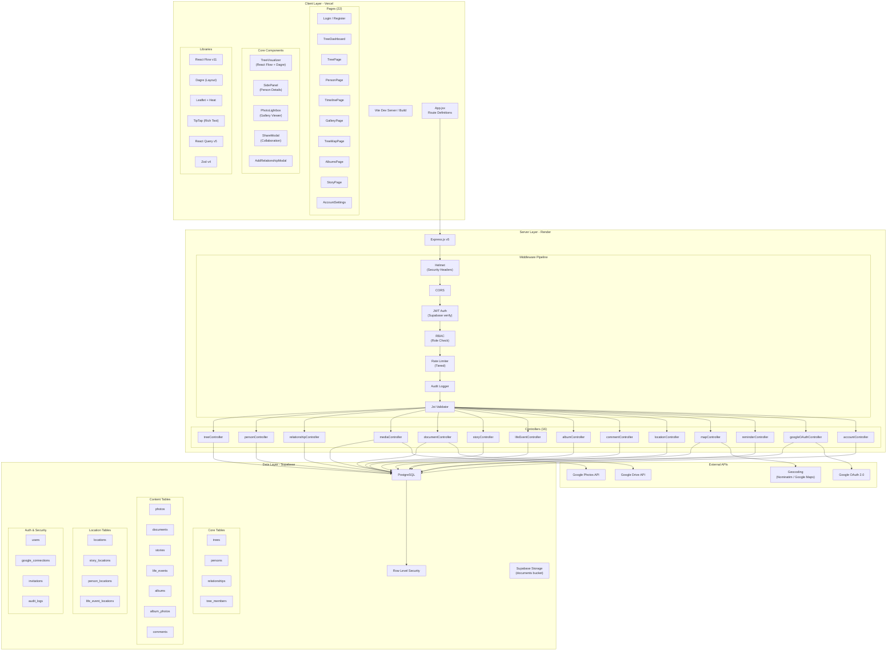
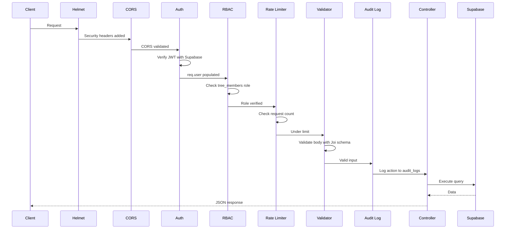
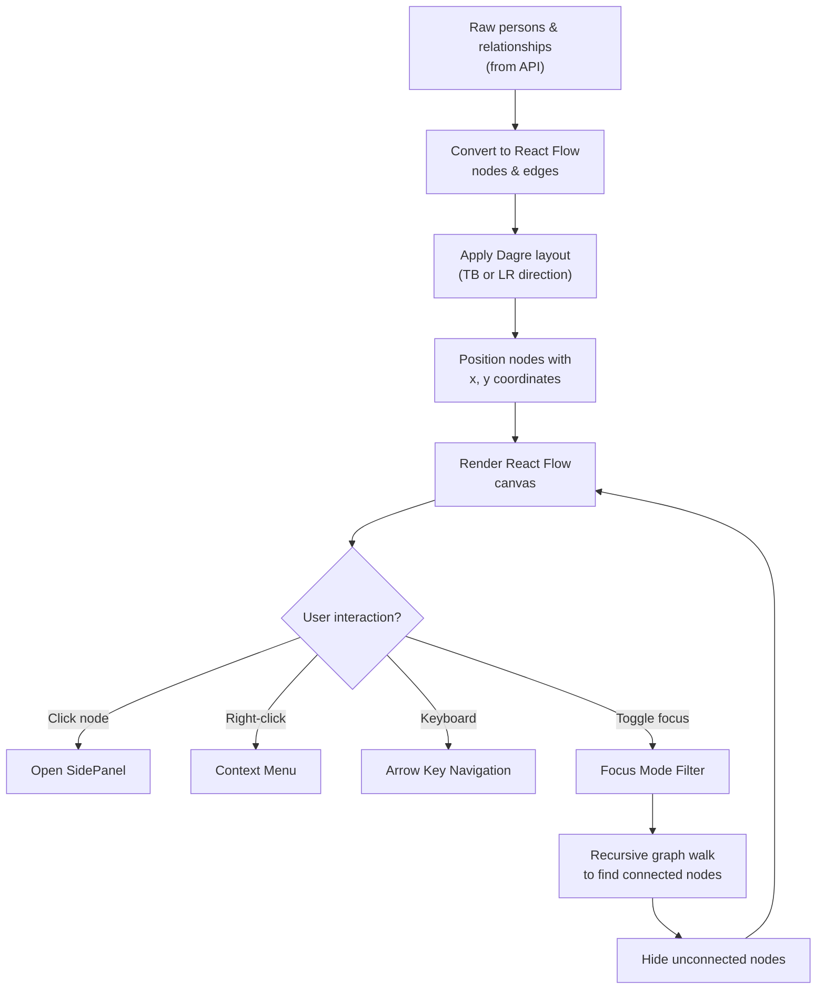
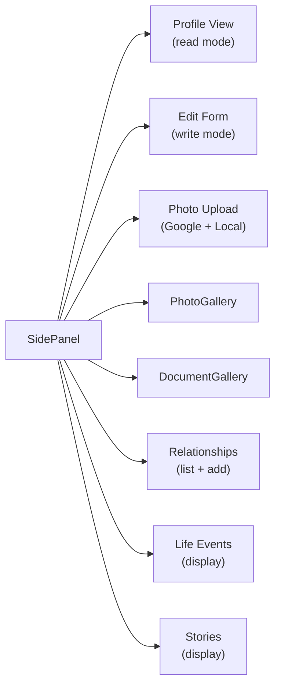
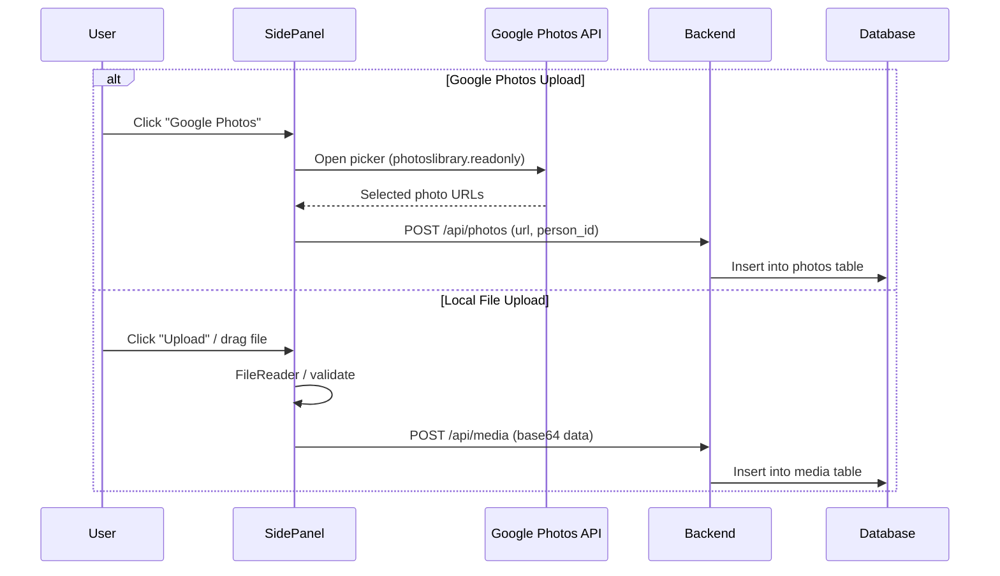
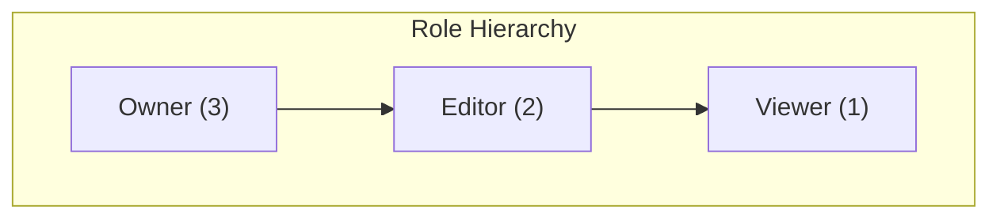
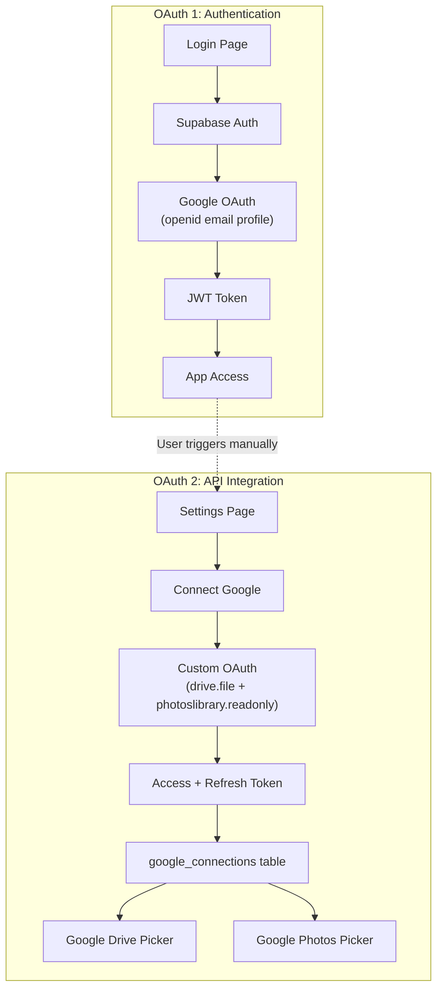
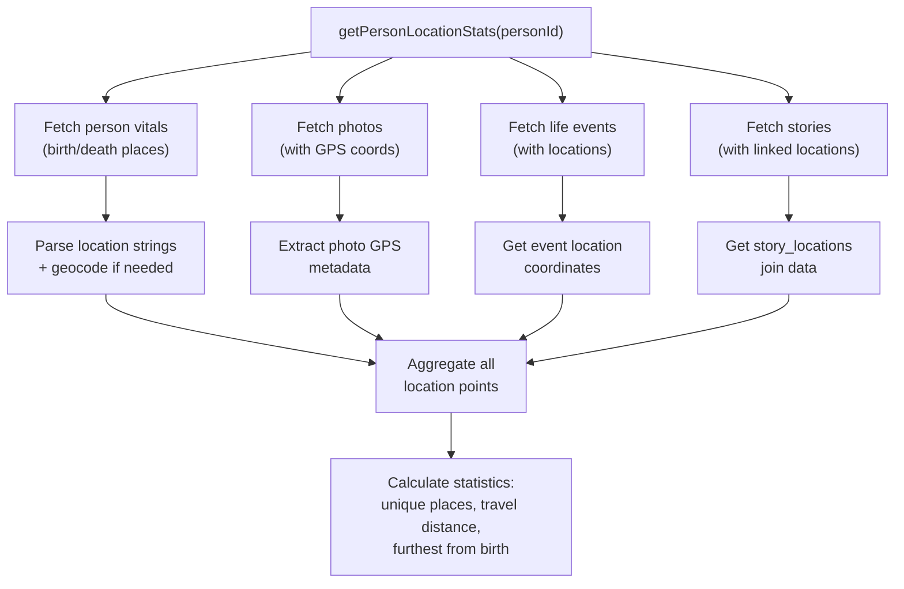
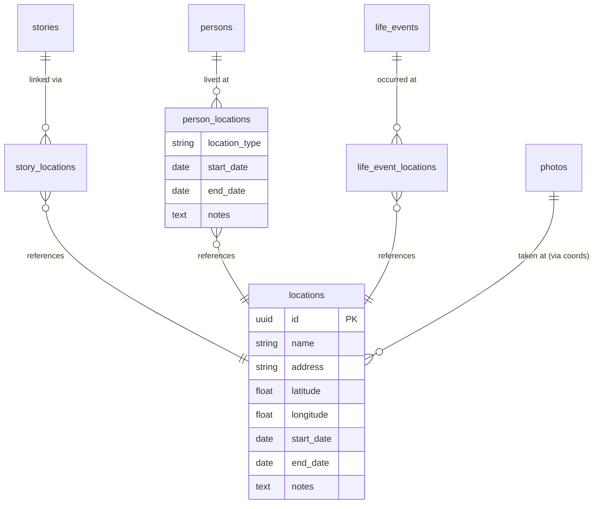
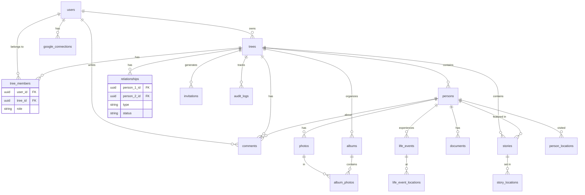

# Architecture & Complex Code Guide

This document provides an architectural overview of the Roots & Branches application with detailed documentation of the most complex code areas. It serves as a reference for understanding system design decisions and navigating the codebase.

---

## System Architecture



---

## Request Lifecycle

Every API request flows through the following middleware pipeline in order:



---

## Complex Code Areas

### 1. TreeVisualizer — Layout Engine (970 lines)

**File:** `client/src/components/TreeVisualizer.jsx`

The tree layout uses [Dagre](https://github.com/dagrejs/dagre) to compute hierarchical positions from raw person/relationship data. The layout flow:



#### Focus Mode Algorithm
The focus mode recursively walks the graph to find all ancestors and descendants of a selected person:

```javascript
// Simplified focus mode logic
function getConnected(nodeId, direction) {
  const visited = new Set();
  const queue = [nodeId];
  while (queue.length > 0) {
    const current = queue.shift();
    if (visited.has(current)) continue;
    visited.add(current);
    // Find edges where current is source (descendants) or target (ancestors)
    edges.forEach(edge => {
      if (direction === 'down' && edge.source === current) queue.push(edge.target);
      if (direction === 'up' && edge.target === current) queue.push(edge.source);
    });
  }
  return visited;
}
// Union of ancestors + descendants = visible nodes
const visible = new Set([...getConnected(id, 'up'), ...getConnected(id, 'down')]);
```

#### Undo/Redo Pattern
Uses a simplified command pattern with history stack:
- `addToHistory(action)` — Pushes `{type, data, timestamp}` to history array
- `handleUndo()` — Pops from history, applies reverse operation
- `handleRedo()` — Pops from redo stack, re-applies operation
- History is capped at 50 entries

---

### 2. SidePanel — Person Detail Manager (967 lines)

**File:** `client/src/components/SidePanel.jsx`

This component orchestrates 8 distinct concerns for a single person:



#### Photo Upload Flow
The component handles two distinct upload paths:



> ⚠️ **Known Issue:** These two paths write to different tables (`photos` vs `media`). The `media` path is legacy and the `photos` path is the canonical system. See the audit report for details.

---

### 3. RBAC Middleware — Role Hierarchy

**File:** `server/middleware/rbac.js`

The RBAC system uses a numeric hierarchy to determine access:



**How it works:**
1. `requireTreeRole(requiredRole)` is a factory that returns middleware
2. The middleware extracts `treeId` from route params (tries `:treeId`, `:id`, or body)
3. Queries `tree_members` for the user's role in that tree
4. Also checks if user is the tree's `owner_id` (implicit owner even without a `tree_members` row)
5. Compares role hierarchy: `user_role_level >= required_role_level`

**Resource-specific variants** (photos, documents, events, stories) extract the `tree_id` through the resource:
```
Photo → person_id → persons.tree_id → tree_members check
```

---

### 4. Dual OAuth Architecture

**File:** `server/controllers/googleOAuthController.js`, `server/routes/googleOAuth.js`

The application uses **two separate OAuth flows** by design:



**Why two flows?** Supabase's `provider_token` (for API access) is ephemeral and lost on session refresh. The dual pattern stores API tokens independently in `google_connections`, with automatic refresh via `getValidToken`.

---

### 5. Map Controller — Haversine Distance

**File:** `server/controllers/mapController.js`

The `getNearbyPhotos` endpoint uses the Haversine formula to find photos within a geographic radius. The `getPersonLocationStats` function aggregates locations from 4 different sources:



---

### 6. Location System — Normalized Architecture

**File:** `server/controllers/locationController.js`

Locations use a normalized design with join tables for many-to-many relationships:



---

### 7. Validation Layer — Custom Validators

**File:** `server/validation/schemas.js`

Beyond standard field validation, the system includes domain-specific logic:

| Validator | Logic |
|-----------|-------|
| **Impossible date detection** | Checks if `dod` (death) is before `dob` (birth) |
| **Age validation** | Max 150 years between birth and today |
| **Self-relationship prevention** | `person_1_id !== person_2_id` |
| **Future date prevention** | No dates after current date |
| **Occupation history** | Accepts both array of strings and comma-separated string |

---

### 8. Export System — GEDCOM Generation

**File:** `server/routes/export.js`

The GEDCOM export generates GEDCOM 5.5.1 format (industry standard for genealogy):
- Outputs `INDI` records for persons with `NAME`, `BIRT`, `DEAT`, `BURI`, `OCCU` tags
- Outputs `FAM` records for spouse relationships
- Handles date format conversion (ISO → GEDCOM: `01 JAN 1980`)
- Sets download headers for browser file download

---

### 9. Reminder Engine — Date Window Matching

**File:** `server/controllers/reminderController.js`

The upcoming events engine scans all persons/events for dates matching a 30-day window. It handles month boundary wrapping (e.g., January 20 → February 19):

```javascript
// Month boundary logic
if (currentMonth === nextMonthMonth) {
  // Same month: simple range check
  return month === currentMonth && day >= currentDay && day <= nextMonthDay;
} else {
  // Crosses month boundary: check either month
  if (month === currentMonth && day >= currentDay) return true;
  if (month === nextMonthMonth && day <= nextMonthDay) return true;
  return false;
}
```

---

### 10. Database Schema



---

*Last updated: February 2026*
