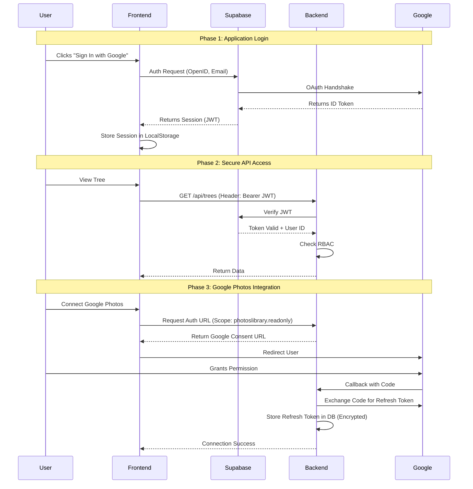
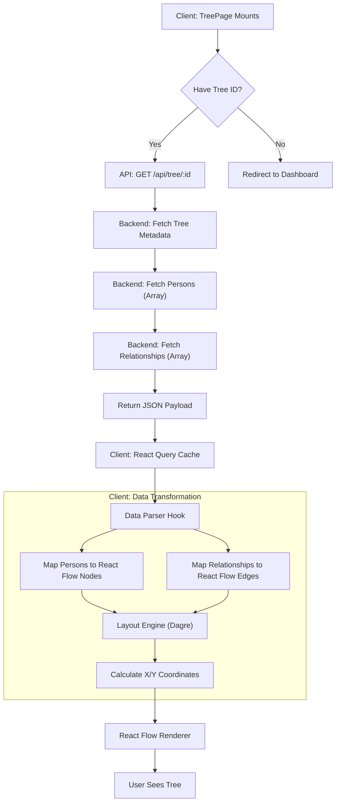
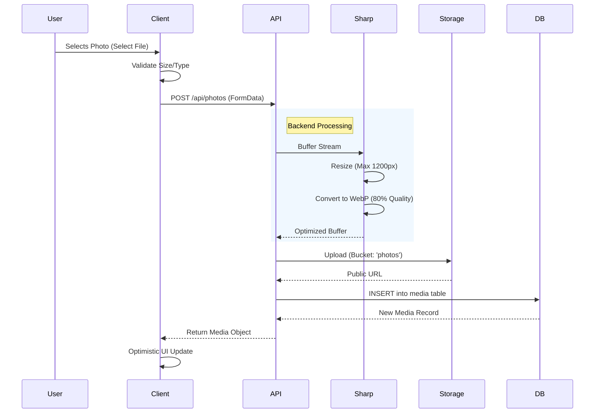

# Complex Process Diagrams

## Authentication Flow (Dual OAuth)

This diagram illustrates the separation between application login and third-party service integration.

## Tree Data Fetching & Rendering

How the application loads and displays the complex family tree structure.

## Image Upload Pipeline

The process for handling user uploads securely and optimizing them for performance.

