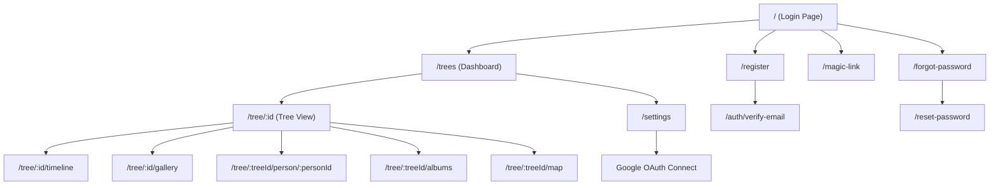

# 🏛️ State of the Union: Roots & Branches Codebase Audit

**Date:** February 28, 2026  
**Scope:** Full repository — `/client` (145 files), `/server` (69 files), `/docs` (5 files)

---

## Executive Summary

Roots & Branches is a **feature-rich** application that has grown rapidly through 18+ development phases. The core architecture (React + Express + Supabase) is sound, but the speed of feature delivery has created **significant documentation drift**, **several god objects**, and **accumulated technical debt** that threatens maintainability. The codebase is functional but increasingly fragile — one more rushed feature sprint risks creating cascading bugs.

> [!CAUTION]
> The `README.md` contains an **unresolved git merge conflict marker** at line 274 (`<<<<<<< HEAD`) with no closing marker. This corrupts the entire document below that point.

---

## Phase 1: Deep Code Review

### ✅ The Good — Clean, Decoupled, Scalable

| Area | Why It's Good |
|------|--------------|
| **Auth Architecture** | Dual OAuth pattern (Phase L) cleanly separates login from API tokens. `google_connections` table is well-designed |
| **RBAC Middleware** | Role hierarchy (`owner > editor > viewer`) with reusable [requireTreeRole](file:///Users/david/Documents/Antigravity/FamilyTreeApp/server/middleware/rbac.js#L22-L149) factory function |
| **Validation Layer** | Joi schemas with custom validators (impossible dates, age limits, self-relationship prevention) in [schemas.js](file:///Users/david/Documents/Antigravity/FamilyTreeApp/server/validation/schemas.js) |
| **Code Splitting** | Proper `lazy()` + `Suspense` for all 20 page routes in [App.jsx](file:///Users/david/Documents/Antigravity/FamilyTreeApp/client/src/App.jsx) |
| **Design System** | Custom UI component library (`Button`, `Input`, `Select`, `Modal`, `Toast`) in `components/ui/` |
| **Rate Limiting** | Tiered rate limiter (general, writes, account deletion) in [rateLimiter.js](file:///Users/david/Documents/Antigravity/FamilyTreeApp/server/middleware/rateLimiter.js) |
| **Audit Logging** | Systematic `auditLog()` middleware on all write routes |
| **React Query** | `@tanstack/react-query` used in newer components (e.g., `PhotoLightbox`) for caching and mutation |

---

### ❌ The Bad — Spaghetti, God Objects, Bloat

#### 🔴 God Object #1: [SidePanel.jsx](file:///Users/david/Documents/Antigravity/FamilyTreeApp/client/src/components/SidePanel.jsx) — **967 lines, 48KB**

This single component handles **8 distinct responsibilities**:
1. Person detail display (read mode)
2. Person detail editing (form mode)
3. Media/photo fetching & display
4. Google Photos upload flow
5. Local file upload flow
6. Profile photo management
7. Relationship listing, creation & deletion
8. Document gallery rendering

> [!WARNING]
> **Line 75 contains a broken URL template literal:**
> ```javascript
> const response = await fetch(`/ api / person / ${person.id}/media`, {
> ```
> The spaces in the URL path will cause **every media fetch to fail silently**.

**Recommended decomposition:**
- `PersonDetailView.jsx` — Read-only display
- `PersonEditForm.jsx` — Edit form
- `PhotoUploadManager.jsx` — Upload flows (Google + local)
- `RelationshipSection.jsx` — Relationship CRUD
- `SidePanel.jsx` — Thin orchestrator

---

#### 🔴 God Object #2: [TreeVisualizer.jsx](file:///Users/david/Documents/Antigravity/FamilyTreeApp/client/src/components/TreeVisualizer.jsx) — **970 lines, 45KB**

Handles **7 responsibilities** in one component:
1. React Flow rendering & layout (Dagre)
2. Focus mode (ancestors/descendants filtering)
3. Undo/Redo command pattern
4. Keyboard navigation (arrow keys, shortcuts)
5. Context menu actions (add person, add relationship, etc.)
6. Layout direction toggle
7. Center-on-person navigation

---

#### 🟡 Large File Inventory (>10KB files needing review)

| File | Size | Concern |
|------|------|---------|
| [PhotoLightbox.jsx](file:///Users/david/Documents/Antigravity/FamilyTreeApp/client/src/components/PhotoLightbox.jsx) | 27KB | Mixes photo display, editing, comments, location, and albums |
| [TreeMapPage.jsx](file:///Users/david/Documents/Antigravity/FamilyTreeApp/client/src/pages/TreeMapPage.jsx) | 27KB | Full map page in single file |
| [TreeDashboard.jsx](file:///Users/david/Documents/Antigravity/FamilyTreeApp/client/src/pages/TreeDashboard.jsx) | 19KB | Tree grid + creation + navigation |
| [TreePage.jsx](file:///Users/david/Documents/Antigravity/FamilyTreeApp/client/src/pages/TreePage.jsx) | 20KB | Main tree orchestration page |
| [AlbumView.jsx](file:///Users/david/Documents/Antigravity/FamilyTreeApp/client/src/components/AlbumView.jsx) | 19KB | Photo grid + edit + delete + lightbox |
| [mapController.js](file:///Users/david/Documents/Antigravity/FamilyTreeApp/server/controllers/mapController.js) | 24KB | `getPersonLocationStats` alone is 250 lines |
| [PersonHeatmap.jsx](file:///Users/david/Documents/Antigravity/FamilyTreeApp/client/src/components/PersonHeatmap.jsx) | 17KB | Complex visualization logic |
| [rbac.js](file:///Users/david/Documents/Antigravity/FamilyTreeApp/server/middleware/rbac.js) | 13KB | Repetitive per-resource role functions |
| [AddRelationshipModal.jsx](file:///Users/david/Documents/Antigravity/FamilyTreeApp/client/src/components/AddRelationshipModal.jsx) | 16KB | Complex multi-step modal |

---

#### 🟡 Duplicate & Dead Code

| Issue | Location | Impact |
|-------|----------|--------|
| **Duplicate `AccountSettings.jsx`** | `components/AccountSettings.jsx` (7KB) AND `pages/AccountSettings.jsx` (18KB) | Confusion over which is canonical. `App.jsx` imports from `pages/` |
| **Dead `Home` component** | [App.jsx:46-133](file:///Users/david/Documents/Antigravity/FamilyTreeApp/client/src/App.jsx#L46-L133) | `Home` function exists but route `/` maps to `Login`, so `Home` is **never rendered** |
| **Legacy media code** | `SidePanel.handlePhotoSelect` writes to `/api/media`, while `handleGooglePhotosUpload` writes to `/api/photos` | Two parallel photo storage paths |
| **Empty API directory** | `client/src/api/` | Created but never used — no API abstraction layer |
| **Debug logging in routes** | [api.js:57-60](file:///Users/david/Documents/Antigravity/FamilyTreeApp/server/routes/api.js#L57-L60) | `console.log('GET /tree/:id/photos hit')` left in production route |
| **SentryTest component** | [SentryTest.jsx](file:///Users/david/Documents/Antigravity/FamilyTreeApp/client/src/components/SentryTest.jsx) | References Sentry but project uses custom error logging |
| **Test routes in production** | `/api/test/*` endpoints in [api.js:155](file:///Users/david/Documents/Antigravity/FamilyTreeApp/server/routes/api.js#L155) | Error test endpoints exposed in production |

---

#### 🔴 Inconsistent Test Placement

Tests are split across **two patterns** with no clear convention:

```
❌ Mixed locations:
  components/LifeEventsList.test.jsx    ← co-located
  components/PhotoMap.test.jsx          ← co-located
  components/StoryList.test.jsx         ← co-located
  components/dashboard/EventsWidget.test.jsx ← co-located
  utils/photoUtils.test.js              ← co-located
  
  test/components/Button.test.jsx       ← in test dir
  test/components/SearchBar.test.jsx    ← in test dir
  test/integration/*.test.js            ← in test dir
  test/unit/*.test.js                   ← in test dir
```

---

### 💀 The Ugly — Recent Technical Debt

| Issue | Severity | Detail |
|-------|----------|--------|
| **Merge conflict in README** | 🔴 Critical | Line 274: `<<<<<<< HEAD` with no closing markers. Makes README unparseable below Phase P |
| **README content duplication** | 🔴 High | Progress sections appear **twice** (lines 56-177 AND lines 396-515), with contradictory percentages |
| **`instructions.md` line 233 corruption** | 🟡 Medium | `[x]#### Week 3:` — checkbox fused with heading, missing newline |
| **No API abstraction layer** | 🟡 Medium | Every component calls `fetch()` directly with inline `supabase.auth.getSession()` token handling — same 5-line pattern repeated 30+ times |
| **Server has no test runner** | 🔴 High | `server/package.json` has `"test": "echo \"Error: no test specified\""` — zero backend test infrastructure |
| **29 SQL migration files, no runner** | 🟡 Medium | Migrations are manual "copy-paste into Supabase SQL editor" — no automated migration system |
| **No `.env.example` parity** | 🟡 Medium | Client `.env.example` exists but server `.env.example` may be incomplete |

---

## Phase 2: Documentation Sync — The Gap Analysis

### API Documentation vs Reality

[API.md](file:///Users/david/Documents/Antigravity/FamilyTreeApp/docs/API.md) documents **~20 endpoints**. The actual [api.js](file:///Users/david/Documents/Antigravity/FamilyTreeApp/server/routes/api.js) has **60+ routes**.

| API Group | In Code | In Docs | Gap |
|-----------|---------|---------|-----|
| Trees | 4 | 4 | ✅ |
| Persons | 4 | 4 | ✅ |
| Relationships | 2 | 2 | ✅ |
| Invitations/Members | 5 | 5 | ✅ |
| Photos | 5 | 4 | ⚠️ Missing `GET /tree/:id/photos` |
| Documents | 4 | 0 | ❌ **Undocumented** |
| Life Events | 6 | 0 | ❌ **Undocumented** |
| Reminders | 1 | 0 | ❌ **Undocumented** |
| Stories | 5 | 0 | ❌ **Undocumented** |
| Albums | 10 | 0 | ❌ **Undocumented** |
| Comments | 3 | 0 | ❌ **Undocumented** |
| Map/Geo | 3 | 0 | ❌ **Undocumented** |
| Locations | 12 | 0 | ❌ **Undocumented** |
| Google OAuth | (separate file) | 0 | ❌ **Undocumented** |
| Config | 1 | 0 | ❌ **Undocumented** |
| Account | 2 | 1 | ⚠️ Missing `PUT /api/account` |
| Export | 2 | 2 | ✅ |
| Logs | 1 | 0 | ❌ **Undocumented** |
| Test | (multiple) | 0 | ❌ **Undocumented** |

> [!IMPORTANT]
> **~67% of API endpoints are completely undocumented.** Any external consumer or new developer would not know these exist.

### Factual Inconsistencies Across Documents

| Topic | README.md | instructions.md | API.md | Actual Code |
|-------|-----------|-----------------|--------|-------------|
| Relationship types | Not specified | `parent_child, spouse, adoptive_parent_child, step_parent_child` | `parent_child, spouse, adoptive_parent_child, sibling` | Schema: all 5 including `sibling` AND `step_parent_child` |
| Account deletion rate limit | "2 req/hour" (line 75 in instructions) | Same | "5 req/15min" | Code uses `accountDeletionLimiter` — need to verify actual values |
| Phase K progress | 85% (README) | 98% (instructions) | N/A | Contradictory |
| Test pass rate | "34/36 (94%)" (README line 656) | "36 tests (100%)" (instructions line 220) | N/A | Contradictory |
| Last updated | Not stated | "Dec 2024" (line 490) | N/A | >1 year stale |

### User Flow Verification

The `App.jsx` routing structure reveals these flows:



> [!NOTE]
> Route `/story/:id` exists but has **no `treeId`** in the URL pattern, unlike other tree-scoped routes. This means stories can only be accessed by ID, not scoped to a tree context in the URL.

---

## Phase 3: Stabilization Strategy

### 🔧 Refactoring Roadmap — Priority Order

#### Tier 1: Immediate (Prevent Further Decay)

| # | Action | Effort | Risk | Files |
|---|--------|--------|------|-------|
| 1 | **Fix README merge conflict** — Remove `<<<<<<< HEAD`, deduplicate content, reconcile percentages | 30min | Low | `README.md` |
| 2 | **Fix SidePanel.jsx URL bug** — Remove spaces from fetch URL on line 75 | 5min | Low | `SidePanel.jsx` |
| 3 | **Remove dead code** — Delete `Home` component from `App.jsx`, remove `components/AccountSettings.jsx` duplicate, clear empty `api/` directory | 15min | Low | Multiple |
| 4 | **Remove debug logging** — Strip `console.log` from route middleware | 5min | Low | `routes/api.js` |
| 5 | **Guard test routes** — Add `NODE_ENV !== 'production'` check for `/api/test/*` | 10min | Low | `routes/api.js` |

#### Tier 2: Near-Term (Improve Maintainability)

| # | Action | Effort | Files |
|---|--------|--------|-------|
| 6 | **Create API service layer** — Extract the repeated `fetch() + getSession() + token` pattern into a centralized `apiClient.js` | 2-3hrs | New `client/src/api/apiClient.js`, then refactor all components |
| 7 | **Decompose SidePanel.jsx** — Split into 4-5 focused components | 3-4hrs | `components/SidePanel.jsx` → multiple files |
| 8 | **Decompose TreeVisualizer.jsx** — Extract undo/redo, keyboard nav, focus mode into hooks | 3-4hrs | `components/TreeVisualizer.jsx` → custom hooks |
| 9 | **Standardize test location** — Move all co-located `.test.*` files to `test/` directory | 1hr | 5 test files |
| 10 | **Add server test infrastructure** — Install Vitest or Jest for backend, create at least controller smoke tests | 2-3hrs | `server/package.json`, new test files |

#### Tier 3: Strategic (Production Readiness)

| # | Action | Effort | Files |
|---|--------|--------|-------|
| 11 | **Update API documentation** — Document all 60+ routes in `API.md` | 3-4hrs | `docs/API.md` |
| 12 | **Reconcile README + instructions.md** — Single source of truth for project status | 2hrs | Both files |
| 13 | **Implement migration runner** — Add `node-pg-migrate` or similar, convert SQL files | 4-6hrs | `server/migrations/` |
| 14 | **Add security headers** — Implement CSP, HSTS via Helmet config | 1-2hrs | `server/index.js` |
| 15 | **RBAC DRY refactor** — Reduce 6 near-identical `require*Role()` factory functions to a generic parameterized version | 2hrs | `middleware/rbac.js` |

---

### 📋 Context Guards — Preventing Future Drift

| Guard | Implementation | Purpose |
|-------|---------------|---------|
| **ESLint max-lines rule** | Add `"max-lines": ["warn", 300]` to `eslint.config.js` | Prevent new god objects |
| **Pre-commit hook** | Use `husky` + `lint-staged` to run ESLint and tests before commit | Catch issues early |
| **API doc generation** | Add JSDoc to routes, generate docs with `swagger-jsdoc` | Keep API docs in sync with code |
| **Architecture Decision Records** | Create `docs/adr/` folder with numbered decision documents | Record WHY decisions were made |
| **README health check** | Add CI step to validate no merge conflict markers in `.md` files | Prevent README corruption |
| **Component README files** | Add `README.md` in `components/`, `pages/`, `hooks/` with conventions | Guide new code placement |
| **`.env.example` sync** | Add CI check that all env vars in `.env` are in `.env.example` | Prevent deploy failures |

---

## Appendix: File Size Distribution

```
📊 Top 15 Largest Source Files:

  48KB  SidePanel.jsx         🔴 GOD OBJECT
  45KB  TreeVisualizer.jsx    🔴 GOD OBJECT
  27KB  PhotoLightbox.jsx     🟡 Needs decomposition
  27KB  TreeMapPage.jsx       🟡 Complex but focused
  24KB  mapController.js      🟡 Backend god object
  19KB  TreeDashboard.jsx     🟡 Could split
  20KB  TreePage.jsx          🟡 Orchestration page
  19KB  AlbumView.jsx         🟡 Could split
  18KB  PersonHeatmap.jsx     ⚪ Complex visualization
  16KB  AddRelationshipModal  ⚪ Complex form
  16KB  albumController.js    ⚪ Standard CRUD
  15KB  ShareModal.jsx        ⚪ Complex modal
  13KB  rbac.js               🟡 DRY violation
  13KB  DocumentPicker.jsx    ⚪ Google API integration
  13KB  LocationSelector.jsx  ⚪ Search + create
```
